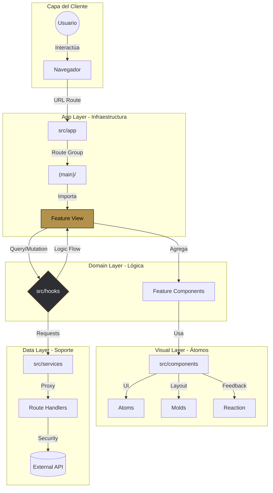
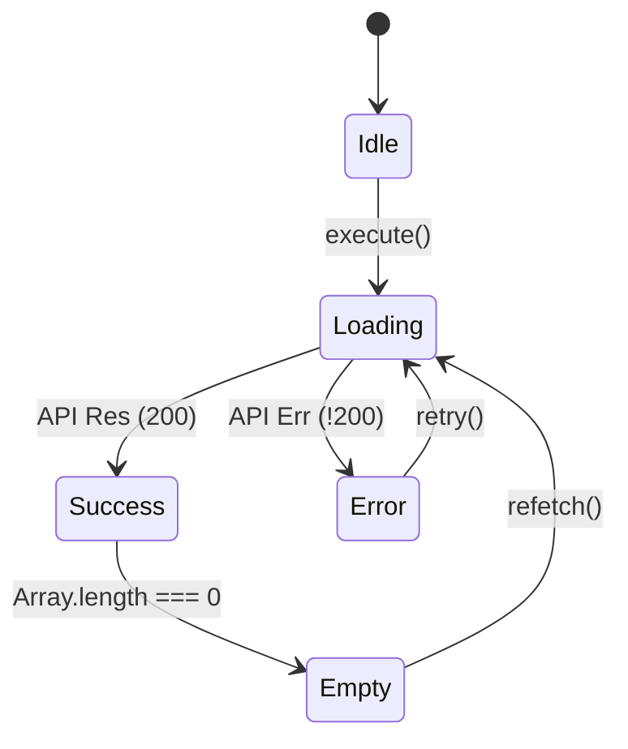
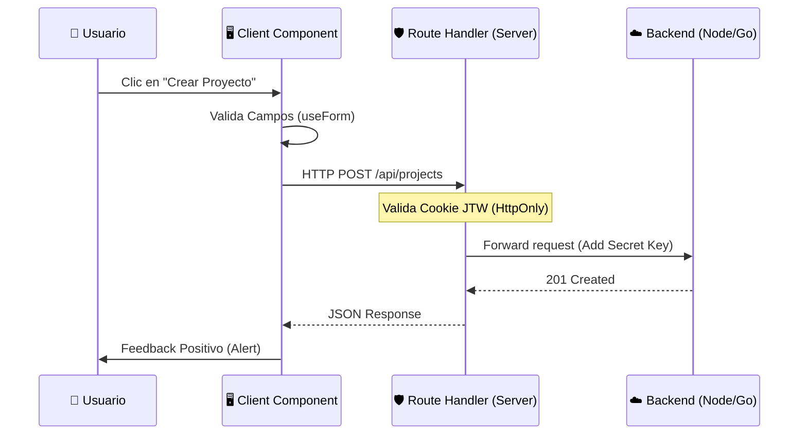

# RV4 System - The Sovereign Engineering Manual


Bienvenido al manual maestro de ingeniería del sistema **RV4**. Este documento no es solo una introducción, sino una especificación técnica profunda del ecosistema, diseñada para garantizar que cada línea de código sea escalable, segura y estéticamente superior.

---

## 🏛️ 1. Filosofía de Arquitectura

RV4 abandona los patrones monolíticos para adoptar una arquitectura **Feature-Driven (Basada en Funcionalidades)**. Este enfoque desacopla la lógica de negocio de la infraestructura del framework, permitiendo que el equipo escale el producto sin generar deuda técnica masiva.

### 🧩 Diagrama de Interconexión de Capas



---

## 📂 2. Especificación de Directorios (`src/`)

### � `src/app/` - Capa de Enrutamiento
Nex.js 15 App Router. Esta carpeta es **puramente estructural**.
- **`(main)/`**: Route Group para páginas que comparten el `Sidebar`. Mantiene los paths dinámicos limpios.
- **`layout.tsx`**: El "Root Shell". Inyecta fuentes, estilos globales y el `ClientLayout`.
- **`error.tsx`** & **`not-found.tsx`**: Manejadores de errores globales integrados con la feature de errores.

### 📁 `src/features/` - El Núcleo de Dominio
Cada subdirectorio representa una **entidad de negocio** completa.
- **`home/`**: Página de aterrizaje y onboarding.
- **`dashboard/`**: Orquestación de métricas complejas.
- **`projects/`**: Gestión de recursos dinámicos.
- **`errors/`**: Centralización de la experiencia de usuario ante fallos.

### � `src/components/` - Presentación Atómica
- **`ui/`**: Componentes sin estado (stateless) y de propósito general.
- **`layout/`**: Define la arquitectura visual de la página (Sidebar, Navbar).
- **`feedback/`**: Componentes de estado de transición (Spinners, Modales, Alerts).

### 📁 `src/hooks/` - Cerebro de la Aplicación
Abstracciones de lógica reactiva. Ninguna lógica compleja debe vivir directamente dentro de un componente UI.

---

## ⚓ 3. Deep Dive: Sistema de Hooks

Los hooks en RV4 son el nexo entre la interfaz y la lógica de datos. Cumplen con el principio de responsabilidad única.

### 🪝 `useSidebar`
Maneja el comportamiento del centro de navegación.
- **Estado**: Boolean (collapsed/expanded).
- **Métodos**: `toggle()`, `collapse()`, `expand()`.
- **Persistencia**: Futura implementación con `localStorage`.

### 🪝 `useFetch<T>`
Motor de peticiones HTTP estandarizado.
- **Estados**: `loading`, `error`, `data`, `empty`.
- **Tipado**: Genérico estricto para asegurar la integridad de los datos recibidos.
- **Diagrama de Ciclo de Vida**:



### 🪝 `useForm<T>`
Controlador de formularios tipado.
- **Validación**: Integra esquemas de validación manuales o con librerías.
- **Envío**: Maneja el estado `isSubmitting` para prevenir múltiples clicks.

---

## 🛡️ 4. Estándares de Ingeniería y TypeScript

### � Naming Conventions
- **Componentes**: PascalCase (`MainButton.tsx`).
- **Hooks**: camelCase con prefijo 'use' (`useProjectData.ts`).
- **Vistas**: Sufijo 'View' (`DashboardView.tsx`).
- **Estilos**: Lowercase con guiones (`main-container`).

### 🔧 TypeScript Strict Mode
El proyecto corre bajo `strict: true`.
- Prohibido el uso de `any`.
- Uso obligatorio de interfaces para Props.
- Tipado de eventos de React (`ChangeEvent`, `FormEvent`).

---

## 🎨 5. Sistema de Diseño (UX/UI Evolution)

### 🖋️ Tipografía: Be Vietnam Pro
Elegida por su equilibrio entre modernidad tecnológica y legibilidad corporativa.
- **Primary**: Weight 900 (Headers).
- **Secondary**: Weight 400 (Body).
- **Numbers**: Weight 700 (Metrics).

### 🌑 Paleta de Colores (Elite Dark)
- `Background`: `#121316` - Reducción de fatiga visual.
- `Accent`: `#B2914B` (Brand Gold) - Denota exclusividad y métricas positivas.
- `Alerts`:
  - Success: `emerald-400`
  - Warning: `amber-400`
  - Error: `rose-400`

---

## 🔄 6. Flujo de Datos y Seguridad (Proxy Pattern)

Para blindar nuestra arquitectura, implementamos el patrón **Backend for Frontend (BFF)** mediante Route Handlers.



---

## ❌ 7. Reglas de Código Innegociables

1.  **Zero Emojis**: La interfaz es 100% iconográfica (Lucide).
2.  **Archivos Cortos**: Si un archivo supera las 150 líneas, debe ser factorizado.
3.  **Comentarios**: El código debe ser autodocumentado. No se permiten comentarios descriptivos redundantes.
4.  **Tailwind-Only**: El uso de CSS archivos externos está limitado a `globals.css` para configuración base.
5.  **Server Components First**: Todo componente nace como Server Component a menos que necesite hooks o eventos.

---

## 🚀 8. Guía de Inicio Rápido para Desarrolladores

### Configuración Inicial
```bash
git clone <repo-url>
npm install
npm run dev
```

### Cómo crear un nuevo flujo
1.  **Definir Dominio**: Crea `src/features/nuevo-flujo/`.
2.  **Crear Vista**: Implementa `NuevoFlujoView.tsx`.
3.  **Vincular Ruta**: Crea `src/app/(main)/nuevo-flujo/page.tsx`.
4.  **Aislar Lógica**: Extrae hooks a `src/hooks/useNuevoFlujo.ts`.

---

## 📈 9. Roadmap de Optimización (Fases Futuras)

| Fase | Objetivo | Tecnología |
| :--- | :--- | :--- |
| **01** | Arquitectura Base | Next.js 15 + Core Features |
| **02** | Data Management | Server Actions + Cache Revalidation |
| **03** | User Security | JWT httpOnly + Middleware |
| **04** | Performance | Image Optimization + Dynamic Imports |

---
*Este manual es la fuente de verdad del proyecto RV4. Cualquier desviación de estos principios debe ser aprobada por el Comité de Arquitectura.*
