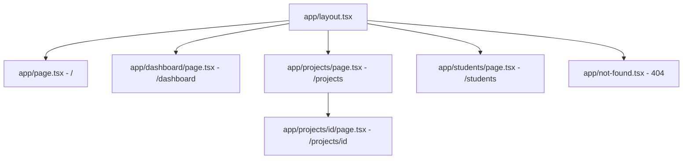

# Día 1: Fundamentos y App Router

En este primer día, el objetivo fue establecer la arquitectura base del proyecto RV4 utilizando el **App Router** de Next.js. Se migró el sistema de enrutamiento anterior (React Router DOM) a una estructura basada en carpetas.

## Conceptos Clave
- **Estructura de Carpetas**: Cada carpeta en `app/` define un segmento de la URL.
- **layout.tsx**: Define la UI compartida (Sidebar/Navbar) sin re-renderizar entre navegaciones.
- **page.tsx**: El contenido único de cada ruta.
- **Rutas Dinámicas**: Uso de `[id]` para capturar parámetros.

## Roadmap de Implementación
1. Inicialización del proyecto con Next.js 15.
2. Limpieza de archivos demo y configuración de `globals.css`.
3. Creación del `RootLayout` con Sidebar y Navbar integrados.
4. Mapeo de rutas de RV4:
   - `/` -> HomeView Premium.
   - `/dashboard` -> Panel de control.
   - `/projects` -> Listado de proyectos.
   - `/projects/[id]` -> Detalle dinámico.
   - `/students` -> Vista de participantes.
5. Implementación de `not-found.tsx` personalizado.

## Diagrama de Arquitectura de Rutas

## Pasos Seguidos
- Se creó la estructura `src/app`.
- Se implementó un Dashboard Layout que envuelve las rutas internas.
- Se configuró el tipado asíncrono de `params` para Next.js 15.
