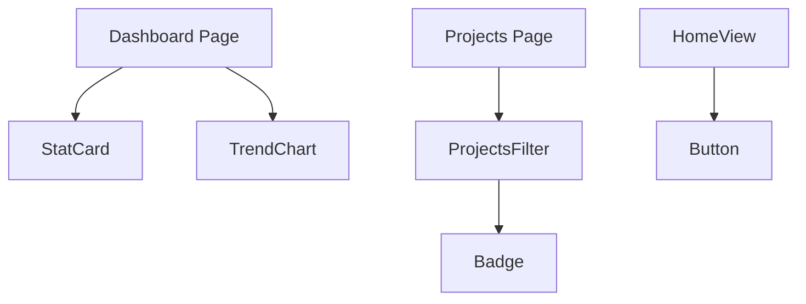

# Día 2: Estilos, Componentes e Imágenes

El segundo día se centró en la **atomización de componentes UI** y la integración profunda de **Tailwind CSS** en la arquitectura de Next.js, junto con el uso de `next/image`.

## Conceptos Clave
- **Atomización**: División de la UI en componentes reutilizables (Atoms) en `src/components/ui`.
- **next/image**: Optimización automática de imágenes para mejorar el LCP.
- **Tailwind Themes**: Configuración de variables de marca en `globals.css` mediante `@theme`.

## Componentes Implementados
Se crearon componentes base en el servidor para maximizar el rendimiento:
- **StatCard**: Visualización de métricas con indicadores de tendencia.
- **Badge**: Etiquetas de estado con variantes de color (success, warning, etc.).
- **Button**: Botón polimórfico que soporta `Link` interno de Next.js.

## Diagrama de Componentes

## Pasos Seguidos
1. Configuración de `globals.css` con la paleta de colores de RV4 (Gold/Dark).
2. Implementación de `src/components/ui` con TypeScript estricto.
3. Sustitución de etiquetas `` por el componente `Image` de Next.js para optimización de carga.
4. Organización de carpetas: `ui/`, `layout/`, `features/`.
