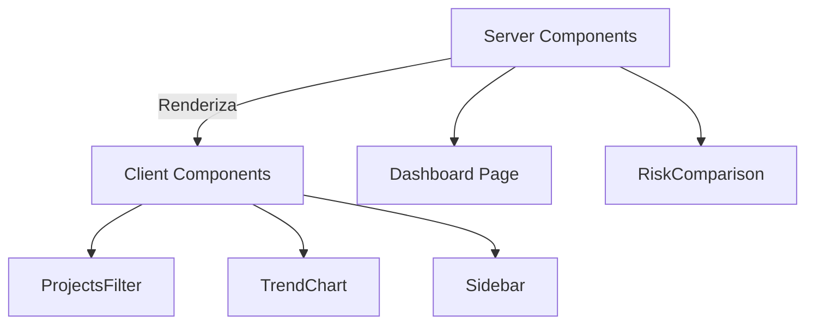

# Día 3: Server vs Client Components

En el día 3, se realizó una auditoría y clasificación técnica de los componentes del proyecto RV4 para aprovechar el modelo híbrido de Next.js.

## El Dilema: ¿Servidor o Cliente?
Next.js rinde mejor cuando la mayoría de los componentes son de **Servidor (Server Components)**. Solo se usa `"use client"` cuando es estrictamente necesario.

## Clasificación de RV4
- **Server Components (Por Defecto)**:
  - `StatCard`, `Badge`, `Button`.
  - `RiskComparison`, `VulnerabilityList`, `RightActivityPanel`.
  - Vistas de página (`DashboardPage`, `ProjectsPage`).
- **Client Components (`"use client"`)**:
  - `TrendChart` (Requiere interactividad/gráficos).
  - `ProjectsFilter` (Manejo de estados de búsqueda).
  - `Navbar` / `Sidebar` (Control de colapso y hooks de navegación).

## Diagrama de Clasificación

## Reglas de Oro Aplicadas
1. Todo componente es de servidor por defecto.
2. Si usa `useState` o `useEffect` -> `"use client"`.
3. Los datos se obtienen preferiblemente en componentes de servidor y se pasan como props.
4. Se eliminaron directivas `"use client"` innecesarias en componentes puramente visuales.
