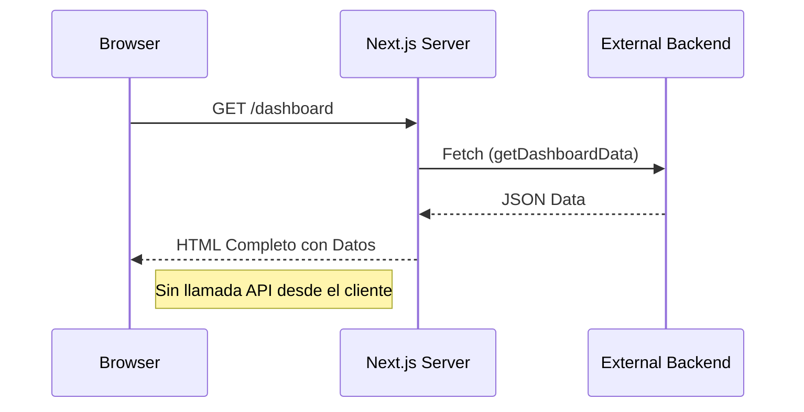

# Día 4: Data Fetching — Servidor y Cliente

El cuarto día implementamos los patrones de obtención de datos más eficientes de Next.js, eliminando los "loading spinners" iniciales mediante el renderizado en servidor.

## Patrones de Fetching
1. **Fetch en Servidor (Async/Await)**:
   - Utilizado en `DashboardPage` y `ProjectsPage`.
   - Ventaja: Los datos llegan listos al navegador, SEO mejorado y carga instantánea.
2. **Fetch en Cliente (Interacción)**:
   - Utilizado en `ProjectsFilter` para búsquedas en tiempo real.
   - Implementado con `AbortController` para evitar "race conditions".
3. **Manejo de Errores (error.tsx)**:
   - Definición de límites de error locales con botón de reintento (`reset`).

## Implementaciones Técnicas
- **apiClient**: Wrapper centralizado para fetch con soporte para revalidación.
- **Caché y Revalidación**: Configuración de `export const revalidate = 60` para mantener el Dashboard fresco.
- **Híbrido Servidor-Cliente**: La página de proyectos carga los `initialProjects` en servidor y el cliente los filtra dinámicamente.

## Flujo de Datos

## Pasos Seguidos
- Implementación de `src/services/apiClient.ts`.
- Refactorización de `DashboardPage` a función asíncrona.
- Creación de `test-fetch` para validación de patrones.
- Implementación de `error.tsx` en rutas críticas.
